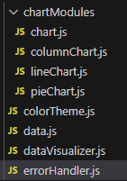
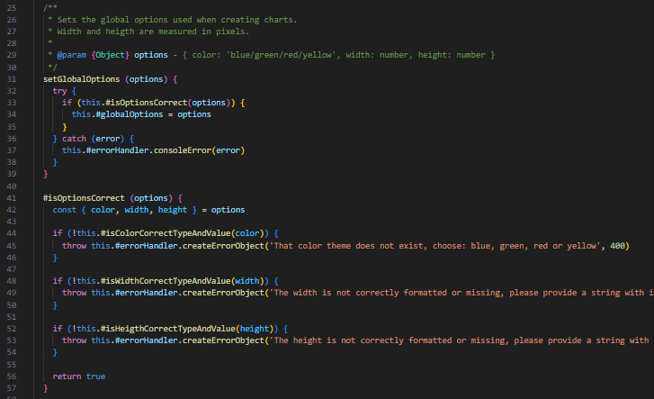
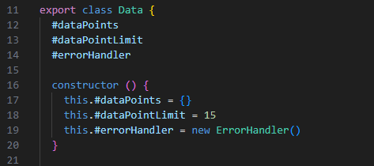
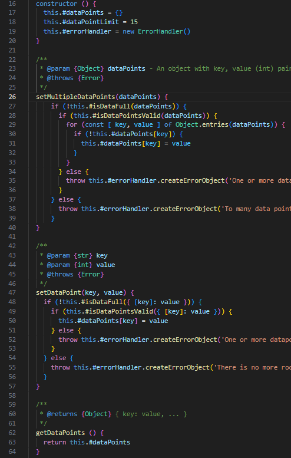
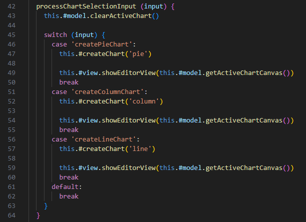
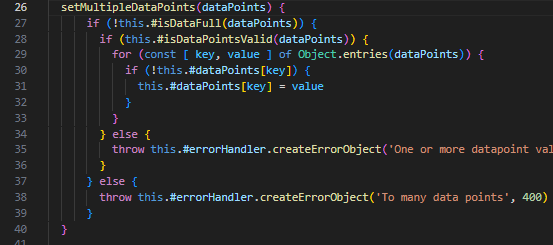

# Reflection L3
These are reflections based around the book Clean Code by Robert C. Martin and the chapters 2-11 on the code for the assignments [L2](https://github.com/JenniferVonT/DataVisualizer) (module) and L3 (this project).

## Chapter 2

**L2** - I think I followed this chapter well in L2 and tried to keep the names as meaningful and descriptive as possible and to avoid leaving false clues when it came to the naming of both classes and variables, they are all pronounceable. All my class names are nouns and say what they mean while my method names are verbs. The only class name I believe is the most "deceptive" is the DataVisualizer, it doesn't technically "visualize" the data, it creates the chart class that in turn visualize it. But I wanted that name for my module as a whole and thus decided to keep the "main" entry point class as the same name as the module at large.

(root directory)

**L3** - This assignment was where I ran in to some trouble trying to follow the second chapter. I decided to follow the MVC (Model View Controller) pattern for this project which made me have a really hard time with the naming of specifically method names and trying not to leave "false clues" by choosing very similar names that can sometimes be hard to differentiate between eachother. Since a lot of my methods do similar stuff but for different inputs and areas of the application I ran into these examples in my controller class for instance:

(./src/controller/controller.js)

I have a really hard time with naming when I'm faced with methods that does similar things but not similar enough to be refactored into one method (since that would also break against the rule that functions should be small)

## Chapter 3

**L2** - I think its hard to make the decision when a function truly only does "one thing", I tried as best as possible to follow this in L2 and refactor as much as possible when possible. It was easier in this project than L3 because the module had "one" goal and that was to create a chart that could be customized. It made it easier to make everything modular and keep the methods short. The one place where I think I failed with this was in the child classes to the Chart class, I tried refactor their methods but always ran into issues with the inheritance making it loose the progress in the process or running into issues with the reach between the parent/child classes and their methods so I decided to keep them long. But every other class in the project have short and concise methods where I interpret the majority to only do "one thing".

(./src/chartModules/pieChart.js)

**L3** - I tried to keep the methods small and arguments short, I managed to keep most methods dyadic or less (whereas the vast majority is nullary, with no arguments) to keep it simple, even in scenarios where I needed a lot of information I made the argument into one object with the data instead of several argument inputs. I have some exceptions to this though where I had to make a triadic method, they are very few and these are only the methods that handle changes to existing data where the original data is needed as a reference

(./src/controller/controller.js)

(./src/model/model.js)

## Chapter 4

**L2** - I decided to keep the comments minimal, leaning more on naming and the code structure to communicate what it does instead, with that said I still decided to implement jsdoc to all of my public methods ateast stating what the argument types should be. I wanted it to also be a help when using the module in an IDE that helps the user by showing the jsdoc when writing the code, making it more user friendly.

(./src/dataVisualizer.js)

**L3** - Since this project isn't geared towards other developers like the L2 module is I decided to omit comments on even the public methods since they aren't really "public" in the same sense as the L2. I believe the method names are descriptive enough, even if some arguments names could be helped by a comment to just clarify the data type. I have written module comments and very few explanatory comments where I think is neccessary. The first examples just clarifies that the catch block isn't left empty for nothing or forgotten, it is there because the element "chart-selector" is not always present in the DOM and gets an error when it can't find it otherwise. The second example is to clarify that the commented line has to come before the rest because the component handles both the blur/unfocus and keywdown event the same and it fires the event twice otherwise since it blurs it after the keywdown event.

(./src/view/view.js)

(./src/view/chart-selector.js)

## Chapter 5
**L2** - I have stuck to the same code format throughout the project, I didn't use any automated tool for this though which means there is a risk that the format I've choosen can have places where they differ, but I have not yet found anywhere noticeable in my code that strays from the set standard. All my global variables in the classes are all declared unaligned at the top of each class and without comment so they aren't to spaced out for an easier overview of the start of the class.

(./src/data.js)

**L3** - What I said for L2 can be applied for L3 aswell, but in this project I have implemented an automatic formatting tool (the npm `standard` package) to help with formatting, this has made it easier to really make sure that the entire code base follows the exact same formatting style everywhere.
A hard thing for me is deciding where to place methods based on conceptual affinity and a logical vertical ordering, if there is just a few methods this isn't an issue, but when several methods starts to use one method I have a hard time figuring out where to put the one method being used by many. For example in this snippet I have an abstract method at the start to show the start page, all the methods fall below in the order they are called, except the `clearEditorPreview` method, that one is also abstract and have several method calls and is used by many methods, I also have the methods called in the `#configureStartingSelectButtons` below these shown. This creates the "scrolling" in the document we want to avoid, but I don't know any better way to sort them besides this.

(./src/view/view.js)

## Chapter 6
**L2** - I have kept the modules very separate in this project, they all only talk to "friends" not "strangers" and hence follows the law of Demeter which means they only calls methods from within themselves or objects that the methods have created, gotten as an argument or the class holds as an instance within itself. I've tried to hide as much data structures as possible and instead leaned on methods for all the data handling, for instance in this example I only use getters and setters for data handling, and only call methods on an object the class hold as an instance (errorHandler):

(./src/data.js)

**L3** - This project was a bit harder to keep separate since I'm handling editing with a preview that updates in real time, also saving, downloading and deleting feature so I had to sent objects as arguments and return values on a much higher scale than I needed in L2. I still tried to hide the internal structure within the class, only using methods to manipulate and reach data and keeping most methods not needed by "outsiders" private. I did have some "trainwrecks" though, where I called a method on a return object that the class didn't really have access to according to Demeters law, I changed it to follow the law and only access the data through instantiated classes within the class.

Before:

After: (this.#model and this.#view are both instantiated in the class as global variables)

(./src/controller/controller.js)

## Chapter 7
**L2** - I have a lot of error handling in the module, since it's going to act as a third party module for other devs I decided to have a try/catch block and throw errors in the majority of methods and did create an entire class for handling the error messaging because of this. I do not return null anywhere to avoid foistering the problem to the caller of the method and I think I managed it pretty well and definitely do not do that to methods that return to the dev using the module.

First I throw an error object created in my error handling class...

... Then I catch the error in the method that calls the one above.

**L3** - In this I had a little bit of a different approach to the error handling than L2, I do not have an ErrorHandling class like L2 because this project was directed to users on the web. I have minimized the user inputs that arent completely controlled by me (i.e buttons) to the bare minimum and still being able to customize the charts. Because of this I decided to use special cases instead in most places where nothing is returned if it is unsuccessful. I did however introduce try/catch statements where I handle third party libs, even if it is my own L2.

## Chapter 8
**L2** -
**L3** -

## Chapter 9
**L2** -
**L3** -

## Chapter 10
**L2** -
**L3** -

## Chapter 11
**L2** -
**L3** -
